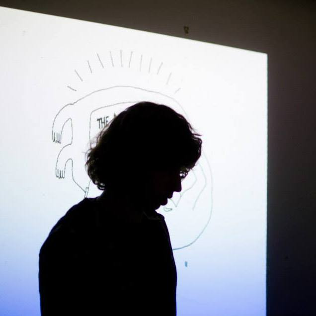

Hello, I'm Andy Howlett, an artist and filmmaker based in Birmingham, UK. I'm interested in walking, concrete, expanded cinema and guerrilla heritage. Here are some of my [films](https://vimeo.com/channels/andyhowlett).

Say hi:
andyhowlett@hotmail.com  
[Twitter](https://twitter.com/aphowlett)  
[Facebook](https://www.facebook.com/andy.howlett.5)

## Projects

- [Paradise Lost: History in the Un-Making](https://www.indiegogo.com/projects/paradise-lost-history-in-the-un-making-architecture) - Feature length video-essay investigating the untimely demise of John Madin's brutalist Central Library.

- [The Magic Cinema](https://en-gb.facebook.com/themagiccinema/)  - DIY film night with "open reel". Bring along a short film and we'll show it. (no actual reel involved) Will be teaming up with Home For Waifs and Strays for a live art cinema called IT'S ALIVE! in 2017
- [Video Strolls](http://videostrolls.com) - Community of artists and filmmakers concerned with place, people and journeying. We host regular public screenings at festivals and things.
- [Cross City Walks](http://xcw.org.uk) - A walking project bisecting cities in straight lines with Pete Ashton.
- Dream 53 - Live art project invoking the spirit of a lost Birmingham Surrealist film.
- Scalarama Birmingham - co-ordinator for the annual celebration of cinema.

<iframe src="https://player.vimeo.com/video/96645962?title=0&byline=0&portrait=0" width="640" height="360" frameborder="0" webkitallowfullscreen mozallowfullscreen allowfullscreen></iframe>

